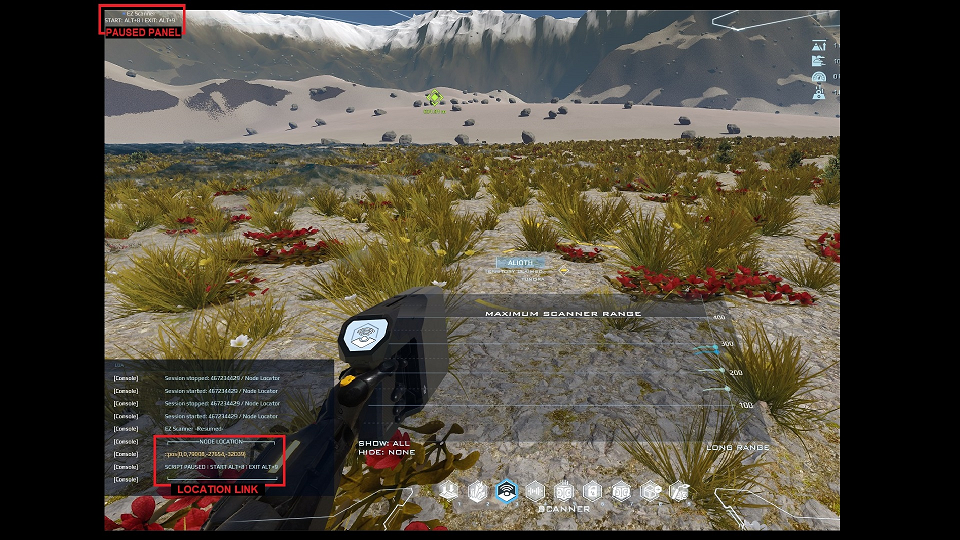

# DU EZ Scanner
Dual Universe Ore Node Finder Script, using the True-range multilateration Algorithm.

### Features
- Simple Main Panel for easy unclutterd UI
- Help Panel for ingame help on how to use script
- Finds the node location with just 4 points
- Easily  add and delete points
- Slider panel for a faster data entry (experimental)
- Script easy pause and exit shortcuts
- Auto paused after point scan

### Requisites

Elements:
- Dynamic core
- Programing board
- Installed Script

## INSTALLATION AND USE

### Installation

- COPY ***du_ez_scanner.lua*** in this repository to your clipboard
- PASTE the code ingame in your Programing Board- 

### Before you run your script
- Make sure you that your scaning node is in range of the Programing Board
- Be mindfull of your CPU / GPU usange, it is very intensive in computational resorces. If you see any problems with it when starting it **press ALT+9** to STOP the Script

### UI

## Use

On your desired scan location and with the programing board in range with the EZ Scanner Script running, do:

1) Open your ore node scanner 
2) Scroll Mouse Wheel to match the distance of the node ping. Add point with Alt+3 and Remove with Alt+5.
3) Space your points at least 50 mts from each other, and never more than 2 points with the same altitude
4) When you have the 4 points, use Alt+4 to find node location
5) Set Destination with Link provided in the lua chat panel on your chat interface
6) Resume Paussed Script with Alt+8 if you want to take an other mesurement.
7) Exit Script (Alt+9)

### Good to know
- Always take points with more than 50 meters apart from each other
- For an acurrate mesurments dont take more than 2 points at the same elevation
- Only Alioth Coords supported ATM, Manualy Change the fist 2 numbers to match your planet
- After the node search the scrip will pause, resume if needed
- All points will be flused after search
- Keep the script paused to save GPU/CPU

### Keyboard Shortcuts

Alt+1 : Help\
Alt+2 : n/a\
Alt+3 : Add Point\
Alt+4 : Find Node \
Alt+5 : Delete Point \
Alt+6 : n/a\
Alt+7 : Tougle Slider On/Off\
Alt+8 : Pause | Resume Script\
Alt+9 : Exit App

## ABOUT

###  Versions
- 1.01 | 2020.11.28 | Initial Public Verion

###  Author
- Juvenius Drakonius (Discord: Juvenius#2318)

### Acknowledgements
- Thank you to [d6rks1lv3rz3r0](https://github.com/d6rks1lv3rz3r0) for his script that helpme finished my own take on the problem. Check out his code [DU-Prospector](https://github.com/d6rks1lv3rz3r0/DU-Prospector)
- [Yamamushi](https://github.com/yamamushi) for just been an amazing help in building amazing code.
- To the [Rekium DU](https://discord.gg/Xy3Sk59p) [[du.rekium.org](du.rekium.org)] guys for pushing me to finish this code that i've been working for weeks to finish

### Planned Upgrades
- Ability to show when a point is NOT 50 meters from an others, and if more than 2 points have the same elevation
- Better UI
- Less code characters
- Better performance

