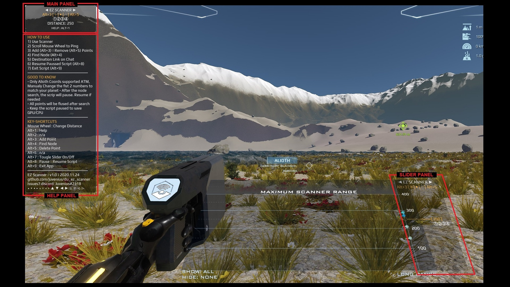

# DU EZ Scanner
Dual Universe Ore Node Finder Script, using the True-range multilateration Algorithm.

# Description
In Dual Universe use this script in a Programing Board and at range to find ore nodes using with just 4 points. It uses a trilateration algothirim similar as how GSPs Systems work. Instalation and use is very Easy, just copy/paste the code and follow the screen instructions.

# Features
- Simple Panel for easy unclutterd UI
- Help Panel
- Finds the node location with just 4 points
- Easily  add and delete points
- Slider panel for a faster data entry (experimental)
- Script easy pause and exit shortcuts
- Auto paused after point scan

# Requisites
- Dynamic core
- Programing board
- Installed Script

# How to Install
- Copy the du_ez_scanner.lua

# How to use

After you installed your script

    1) Open your ore node scanner
    2) Scroll Mouse Wheel to Ping
    3) Add point with Alt+3 and Remove with Alt+5
    4) Find Node with Alt+4
    5) Destination Link on Chat
    6) Resume Paussed Script (Alt+8)
    7) Exit Script (Alt+9)

# Keyboard Shortcuts

Alt+1 : Help\
Alt+2 : n/a\
Alt+3 : Add Point\
Alt+4 : Find Node \
Alt+5 : Delete Point \
Alt+6 : n/a\
Alt+7 : Tougle Slider On/Off\
Alt+8 : Pause | Resume Script\
Alt+9 : Exit App\

# Good to know
- Only Alioth Coords supported ATM, Manualy Change the fist 2 numbers to match your planet
- After the node search the scrip will pause, resume if needed
- All points will be flused after search
- Keep the script paused to save GPU/CPU

